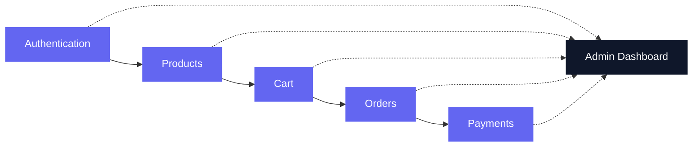
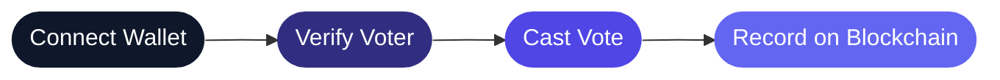

<div align="center">


<a href="https://git.io/typing-svg">
  
</a>

<br/>


</div>

<br/>

## 🧠 About Me

<table>
<tr>
<td width="60%" valign="top">

```yaml
whoami: Anupam
role: Java Full Stack Developer
mindset: "I don't just write code. I build systems."

currently:
  - 🏗️  Building full-stack applications
  - ☕  Strengthening Java & Spring Boot
  - 🧩  Exploring system design & scalable architecture
  - 🔁  Solving problems one commit at a time

goal: >
  Write clean code, understand how systems
  really work, and keep getting better — every day.
```

</td>
<td width="40%" valign="top" align="center">


</td>
</tr>
</table>

<br/>

## ⚙️ My Toolkit

<div align="center">


<br/>


</div>

<br/>

## 🚀 Things I've Built

<br/>

### 🛒 Veylo — *Full-Stack E-Commerce Platform*
> A complete e-commerce platform built with real-world business logic.



`Authentication` `Product Management` `Cart` `Orders` `Payments` `Admin Panel`

<br/>

### 🗳️ VoteLedger — *Blockchain-Based Voting Application*
> A decentralized voting application focused on security, transparency, and trust.



`Blockchain` `MetaMask` `Smart Contracts` `Decentralized Voting`

<br/>

### 👨‍💼 Employee Management System — *Java Full-Stack Application*
> A web-based system for managing employee records and operations.

`Java` `Spring MVC` `Hibernate` `JSP` `MySQL`

<br/>

## 📈 GitHub Activity

<div align="center">


</div>

> 💡 **Note:** Replace `anupam` in every widget URL above with your exact GitHub username so the stats, streaks, and graphs pull your real data.

<br/>

## 🔭 What I'm Exploring Now

<div align="center">


</div>

<br/>

## 💬 Let's Build Something Meaningful

<div align="center">

[](#)
[](#)
[](#)

<br/>

*Thanks for stopping by 👋 — always open to collaborating on something worth building.*


</div>
